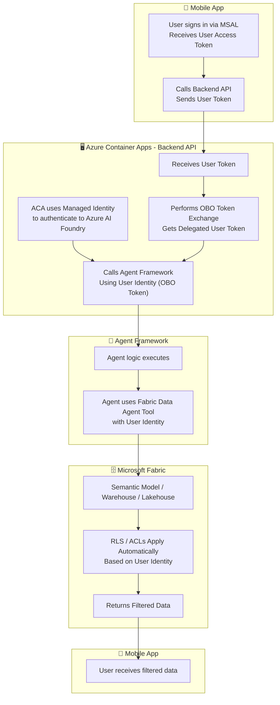
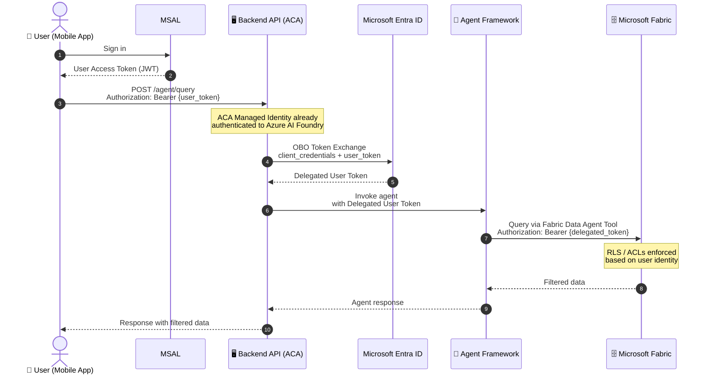

# Security

## Request Flow

```mermaid
flowchart TD

    %% Mobile App Layer
    subgraph MobileApp["📱 Mobile App"]
        A1["User signs in via MSAL<br/>Receives User Access Token"]
        A2["Calls Backend API<br/>Sends User Token"]
    end

    %% Backend API Layer (ACA)
    subgraph Backend["🖥️ Azure Container Apps - Backend API"]
        B0["ACA uses Managed Identity<br/>to authenticate to Azure AI Foundry"]
        B1[Receives User Token]
        B2["Performs OBO Token Exchange<br/>Gets Delegated User Token"]
        B3["Calls Agent Framework<br/>Using User Identity (OBO Token)"]
    end

    %% Agent Framework Layer
    subgraph AgentFramework["🤖 Agent Framework"]
        C1[Agent logic executes]
        C2["Agent uses Fabric Data Agent Tool<br/>with User Identity"]
    end

    %% Fabric Layer
    subgraph Fabric["🗄️ Microsoft Fabric"]
        D1[Semantic Model / Warehouse / Lakehouse]
        D2["RLS / ACLs Apply Automatically<br/>Based on User Identity"]
        D3[Returns Filtered Data]
    end

    %% Return to App
    subgraph Return["📱 Mobile App"]
        E1[User receives filtered data]
    end

    %% Flow connections
    A1 --> A2
    A2 --> B1
    B1 --> B2
    B0 --> B3
    B2 --> B3
    B3 --> C1
    C1 --> C2
    C2 --> D1
    D1 --> D2
    D2 --> D3
    D3 --> E1
```

## Request Sequence

```mermaid
sequenceDiagram
    autonumber
    actor User as 📱 User (Mobile App)
    participant MSAL as MSAL
    participant API as 🖥️ Backend API (ACA)
    participant Entra as Microsoft Entra ID
    participant Agent as 🤖 Agent Framework
    participant Fabric as 🗄️ Microsoft Fabric

    User->>MSAL: Sign in
    MSAL-->>User: User Access Token (JWT)

    User->>API: POST /agent/query<br/>Authorization: Bearer {user_token}

    Note over API: ACA Managed Identity already<br/>authenticated to Azure AI Foundry

    API->>Entra: OBO Token Exchange<br/>client_credentials + user_token
    Entra-->>API: Delegated User Token

    API->>Agent: Invoke agent<br/>with Delegated User Token

    Agent->>Fabric: Query via Fabric Data Agent Tool<br/>Authorization: Bearer {delegated_token}
    Note over Fabric: RLS / ACLs enforced<br/>based on user identity
    Fabric-->>Agent: Filtered data

    Agent-->>API: Agent response
    API-->>User: Response with filtered data
```
